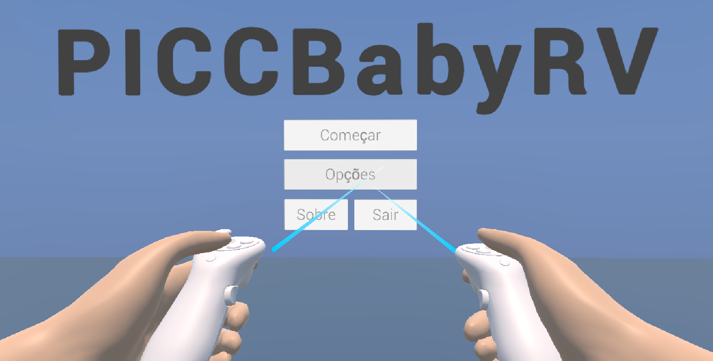
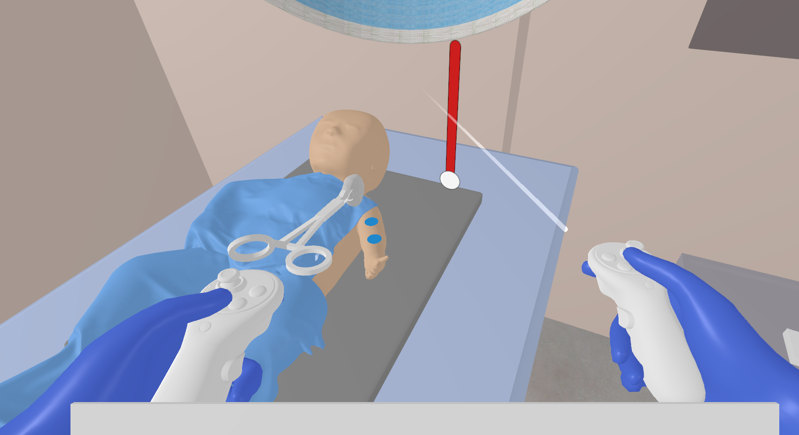
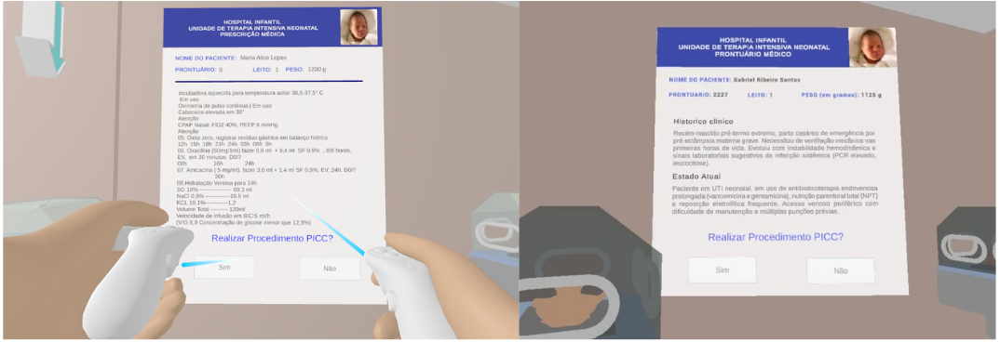

# 👶🩺 PICCBabyRV – Simulador de PICC Neonatal em Realidade Virtual

**PICCBabyRV** é um simulador imersivo em **Realidade Virtual (VR)** desenvolvido para o treinamento de **enfermeiros neonatais** na inserção do **Cateter Central de Inserção Periférica (PICC)** em **recém-nascidos prematuros**.

  

> ⚠️ O projeto tem como objetivo garantir um **acesso vascular seguro e prolongado**, respeitando a fragilidade e o pequeno calibre dos vasos desses bebês.

---

## 🎯 Objetivos

- 🧠 Reforçar o conhecimento teórico e prático da equipe de enfermagem neonatal.
- 🛡️ Minimizar os erros durante o procedimento real em recém-nascidos.
- 🧪 Oferecer uma plataforma de treinamento **realista, segura e interativa**.
- 📚 Incluir desde a **análise do caso clínico até a execução técnica** do procedimento.

---

## 🧩 Funcionalidades do Simulador

✅ Revisão do prontuário do paciente  
✅ Análise do caso clínico e indicação do PICC  
✅ Comunicação com os responsáveis pelo recém-nascido  
✅ Preparação da técnica, higienização e materiais  
✅ Execução do procedimento em ambiente simulado 3D  
✅ Feedback educativo e imersivo sobre a performance  

---

## 🛠️ Tecnologias Utilizadas

- 🕹️ **Unity 3D** (2022.3.x)
- 🌐 **XR Interaction Toolkit**
- 🧪 **OpenXR**
- 🎨 Blender e SketchUp para Modelagem 3D otimizada para realidade virtual
- 🥽 Compatível com dispositivos como **Meta Quest**

---

## 🤝 Colaboradores

Este projeto foi iniciado como uma iniciativa voluntária e posteriormente contemplado pelo edital:

> **PIT/Ebserh/MEJC nº 08/2024** – com apoio do **CNPq**.

Desenvolvido por:

- Bianca Mirtes Araújo Miranda - Graduanda do Bacharel em Tecnologia da Informação no Metrópole Digital - IMD/UFRN e pesquisadora do Centro de Competência EMBRAPII em Tecnologias Imersivas - AKCIT
- Alyson Matheus Souza - Professor do Metrópole Digital - IMD/UFRN e pesquisador do Centro de Competência EMBRAPII em Tecnologias Imersivas - AKCIT
- Débora Feitosa de França - Doutoranda do programa de pós-graduação da Universidade Potiguar
- Ricardo Cobucci - Chefe do setor de pesquisa e inovação tecnológica na MEJC/EBSERH
- Júlia Millene Gomes Magalhães de Lacerda - Graduanda de Medicina na Universidade Federal do Rio Grande do Norte

---

## 📷 Capturas de Tela

  

  

